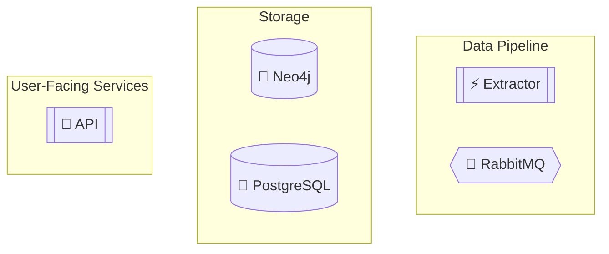
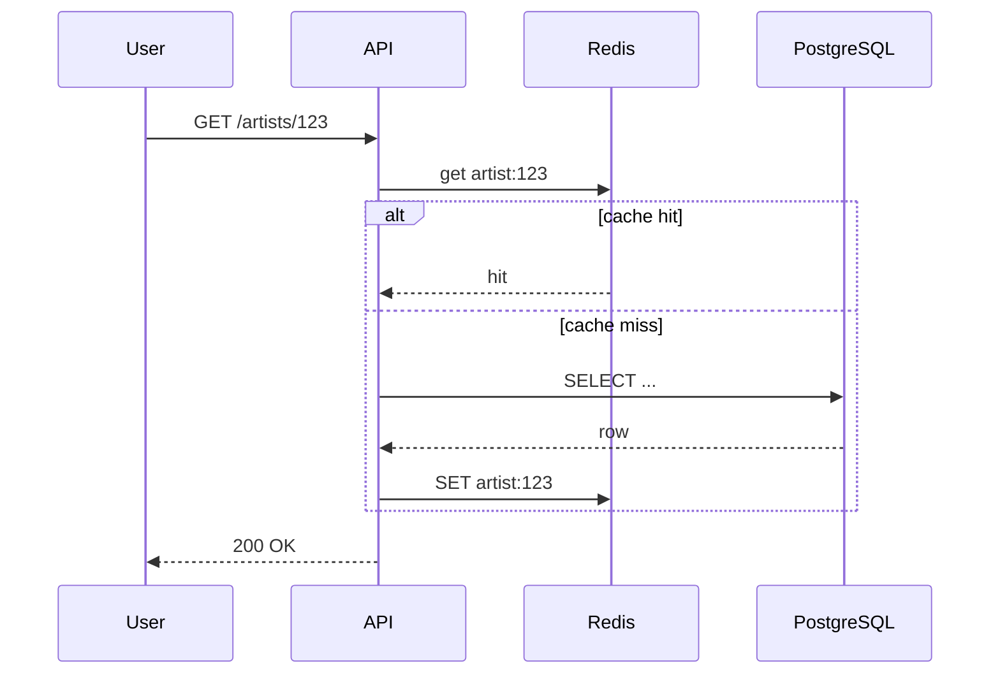

# Mermaid Diagram Conventions

Every project ships at least one Mermaid `graph TD` in the root README, and finer-grained diagrams under `docs/architecture.md`. The style below is what the reference repos (discogsography, phaze, cronduit, nox-scripts) all converge on. Copy it.

## Where diagrams live

- **Root `README.md`** — exactly one `graph TD` showing the high-level architecture: data sources, the pipeline, storage, user-facing services. Aim for 8–14 nodes. Goes in the "Architecture Overview" section.
- **`docs/architecture.md`** — multiple diagrams, one per concern: data flow, service communication, message queue topology, schema relationships. No node limit.
- **Service READMEs** (`<service>/README.md`) — optional sequence diagrams for internal request flows.

## Node shapes by role

Pick the shape from the meaning, not from variety. Consistent shapes across all diagrams make them readable at a glance.

| Role | Shape | Mermaid syntax |
|---|---|---|
| Data source (external) | Cylinder | `S3[("🌐 Source Name")]` |
| Service (Python) | Subroutine | `API[["🔐 API"]]` |
| Service (Rust) | Subroutine | `EXT[["⚡ Extractor"]]` |
| Message queue | Hexagon | `RMQ{{"🐰 RabbitMQ"}}` |
| Database | Cylinder | `PG[("🐘 PostgreSQL")]` |
| Cache | Cylinder | `REDIS[("🔴 Redis")]` |
| Frontend / browser | Subroutine | `EXPLORE[["🔍 Explore"]]` |

Every node label has an emoji prefix matching the service identifier convention in `docs/emoji-guide.md` (if the project has one). The emoji should be stable — the same service uses the same emoji across README, dashboard, logs, and diagrams.

## Subgraphs for layers

Group nodes into subgraphs by logical layer:



Subgraph labels are Title Case in double quotes. Subgraph names (the identifier before `[...]`) are single-word Pascal-ish.

## Edge style by relationship

| Relationship | Edge | Example |
|---|---|---|
| Data flow / write | Solid arrow | `EXT --> RMQ` |
| Bidirectional / shared access | Solid line | `API --- PG` |
| Read-mostly / dependency | Dotted | `INSIGHTS -.-> API` |
| Observation / monitoring | Dotted line | `DASH -.- RMQ` |

Chain multiple edges with `&` when one source fans out: `S3 --> EXT --> RMQ`.

## Color palette

Use these `style` directives at the end of every diagram. Don't reinvent — consistency across projects is the point.

```
style S3 fill:#e1f5fe,stroke:#01579b,stroke-width:2px
style EXT fill:#ffccbc,stroke:#d84315,stroke-width:2px
style RMQ fill:#fff3e0,stroke:#e65100,stroke-width:2px
style NEO4J fill:#f3e5f5,stroke:#4a148c,stroke-width:2px
style PG fill:#e8f5e9,stroke:#1b5e20,stroke-width:2px
style REDIS fill:#ffebee,stroke:#b71c1c,stroke-width:2px
style API fill:#e3f2fd,stroke:#0d47a1,stroke-width:2px
style EXPLORE fill:#e8eaf6,stroke:#283593,stroke-width:2px
style DASH fill:#fce4ec,stroke:#880e4f,stroke-width:2px
style INSIGHTS fill:#fff9c4,stroke:#f57f17,stroke-width:2px
```

Mapping by category (so the color tells you the role):

| Category | Fill | Stroke |
|---|---|---|
| External data source | `#e1f5fe` | `#01579b` |
| Rust service / extractor | `#ffccbc` | `#d84315` |
| Message queue | `#fff3e0` | `#e65100` |
| Graph database | `#f3e5f5` | `#4a148c` |
| Relational database | `#e8f5e9` | `#1b5e20` |
| Cache | `#ffebee` | `#b71c1c` |
| Pipeline worker (graph side) | `#e0f2f1` | `#004d40` |
| Pipeline worker (table side) | `#fce4ec` | `#880e4f` |
| API service | `#e3f2fd` | `#0d47a1` |
| Frontend / explorer | `#e8eaf6` | `#283593` |
| Dashboard / monitoring | `#fce4ec` | `#880e4f` |
| Analytics / insights | `#fff9c4` | `#f57f17` |

If your project has a node type not in this table, pick a Material Design palette swatch with a 50-level fill and 900-level stroke at width 2px.

## Sequence diagrams

For request flows under `docs/architecture.md` or per-service docs, use sequence diagrams:



Conventions:
- Use `participant <ID> as <Label>` when the label has special chars or you want a clean ID.
- Use `alt`/`else`/`end` for branching; don't draw two separate diagrams.
- Use `Note over X,Y: ...` for callouts.

## What to avoid

- **Mermaid `flowchart LR`** for system architecture. Use `graph TD` for top-down clarity. Reserve LR for pipelines/timelines.
- **Color without meaning.** Don't use random palettes per diagram. The color is the legend.
- **Inline styling on every node** when you could put a single `classDef` block. Acceptable to do per-node for small diagrams (<10 nodes), but use `classDef` once a diagram has 10+ nodes.
- **Diagram drift.** If the architecture changes and the README mermaid doesn't, the diagram is worse than nothing. Treat it like code: update in the same PR.
