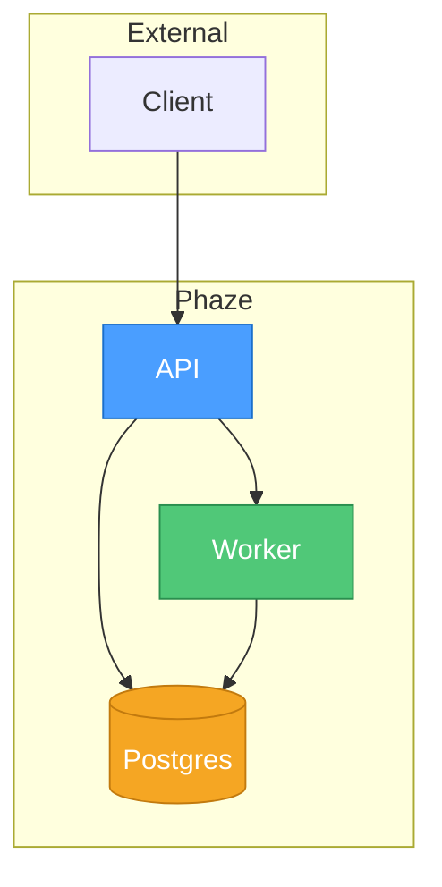
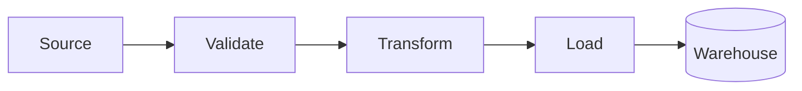

# README Skill

Create and maintain a project's **root `README.md`** using the structure and conventions below. This is a **rigid** skill — follow the section order exactly. Content within each section is adapted to the specific project. For the `docs/` directory suite, use the `comprehensive-docs` skill instead.

## When to Use

- Bootstrapping a new project's root README from scratch
- Auditing an existing README for missing or out-of-order sections
- Standardizing READMEs across a portfolio of projects
- After a significant architecture change, to rewrite the README to reflect it

## README Structure (top to bottom)

### 1. Centered Header Block

Wrap the entire header in `<div align="center">` ... `</div>`:

```markdown
<div align="center">


<!-- badges here -->

**One-sentence project description with key technologies bolded and link to the primary external resource.**

</div>
```

Rules:
- Banner image: use the project's brand banner (dark variant preferred). Width `400` is a good default.
- **No `# H1` title** — the banner image IS the title. The project name only appears in the `alt` attribute.
- Description is bold (`**...**`), one to two sentences max, placed below badges inside the centered div.
- Link key external resources inline (e.g., the data source, the framework).

### 2. Badge Rows

Place badges directly below the banner image, still inside the centered div. Group badges logically with line breaks between groups if needed:

**Group 1 — CI/CD status badges** (linked to workflow runs):
```markdown
[](...)
[](...)
[](...)
```

**Group 2 — Static info badges** (license, language versions, tools):
```markdown


[](https://github.com/astral-sh/uv)
[](https://github.com/astral-sh/ruff)
```

Rules:
- CI badges link to their workflow pages.
- Static badges use shields.io format.
- Include badges for: CI status, test status, coverage, license, primary language versions, package manager, linter, formatter, task runner, security tools, Docker readiness, and any AI tooling.
- Order: CI/CD first, then static/tool badges.

### 3. Navigation Bar

A centered, pipe-separated row of anchor links to key sections. Place outside the header div:

```markdown
<p align="center">

[🚀 Quick Start](#-quick-start) | [📖 Documentation](#-documentation) | [🌟 Features](#-key-features) | [💬 Community](#-support--community)

</p>
```

Rules:
- 3-5 links maximum.
- Each link has an emoji prefix matching its section header.
- Anchors must match the section header slugs exactly (lowercase, hyphens, strip special chars).

### 4. 🎯 What is [Project]?

Intro section. Explains what the project is and what it does in plain language.

**Content pattern:**

```markdown
## 🎯 What is ProjectName?

ProjectName transforms/does [input] into:

- **Emoji Output 1**: Brief description
- **Emoji Output 2**: Brief description
- ...

Perfect for [target audiences] who want to [goal].
```

Rules:
- Lead with what the project transforms or accomplishes in 1-2 sentences.
- Bullet list of 3-7 concrete outputs/capabilities with emoji + bold labels.
- Each bullet is a verb-led phrase describing something the project does.
- Close with a "Perfect for..." sentence naming the target audience.

**Example:**
```markdown
## 🎯 What is Phaze?

Phaze is a distributed data pipeline that transforms raw telemetry events into:

- **📥 Validated records**: JSON-schema-checked payloads with rich error reporting
- **🔄 Transformed streams**: pluggable Python or SQL transformation stages
- **📊 Queryable datasets**: loaded into ClickHouse, Postgres, or BigQuery
- **📈 Live dashboards**: Prometheus metrics and Grafana panels out of the box

Perfect for data teams who want a batteries-included pipeline without stitching ten tools together.
```

### 5. 🏛️ Architecture Overview

Services table plus two Mermaid diagrams: system architecture and a pipeline/data flow.

**Content pattern:**

First, a services/components sub-section with table:
```markdown
### 🧩 Core Services

| Service | Purpose | Key Technologies | Port |
| --- | --- | --- | --- |
| **api** | HTTP ingest and admin API | `FastAPI`, `Pydantic` | 8080 |
| **worker** | Pipeline execution | `Python asyncio` | — |
| **scheduler** | Job orchestration | `Temporal` | 7233 |
| **db** | Metadata store | `Postgres 16` | 5432 |
```

Then a system architecture diagram:
````markdown

````

Then a pipeline/data flow diagram:
````markdown

````

Rules:
- Table columns should suit the project — `Service | Purpose | Key Technologies | Port` is typical but adapt as needed.
- Always include `style` directives on key nodes for color coding.
- Use `subgraph` blocks to group related components.
- Use descriptive node labels with emoji prefixes and `<br/>` for multi-line.
- Keep each diagram focused on one concept. Two minimum: system + pipeline/flow.
- Link to the full architecture doc (`docs/architecture.md`) at the bottom.

### 6. 🌟 Key Features

Bullet list of highlights. Distinct from "What is" — this is about *why you'd pick this project*, not *what it does*.

**Content pattern:**

```markdown
## 🌟 Key Features

- **Emoji Feature Name**: Brief description with concrete numbers where possible
- **Emoji Feature Name**: Brief description
```

Rules:
- 5-10 features max.
- Lead each bullet with an emoji + bold feature name.
- Focus on differentiators, ergonomics, and standout capabilities.
- Include concrete metrics where available (throughput, coverage %, optimization multipliers).
- No sub-bullets; keep it scannable.

**Example:**
```markdown
## 🌟 Key Features

- **⚡ Zero-config local setup**: `docker compose up` and you're running in under 60 seconds
- **🛡️ Type-safe pipeline DSL**: catch schema errors at definition time, not runtime
- **🔁 Built-in replay**: re-process any time window without duplicates
- **📊 Observability by default**: Prometheus, Grafana, and structured logs out of the box
- **🚦 200k events/sec**: benchmarked on a single 4-core worker
```

### 7. 🚀 Quick Start

Prerequisites, minimal setup commands, and a service URLs table.

**Content pattern:**

````markdown
## 🚀 Quick Start

### Prerequisites

- Docker 24+ and Docker Compose v2
- Python 3.11+ (for local dev only)
- 8 GB RAM free

### Setup

```bash
# Clone and start
git clone https://github.com/OWNER/REPO.git
cd REPO
cp .env.example .env
docker compose up -d
```

### Service URLs

| Service | URL | Default Credentials |
| --- | --- | --- |
| **API** | http://localhost:8080 | None |
| **Grafana** | http://localhost:3000 | admin / admin |
| **Postgres** | localhost:5432 | phaze / phaze |
````

Rules:
- Show the absolute minimum commands to get running (typically 3-5 lines).
- Every command must be copy-pasteable and work on a clean clone.
- Include a table of accessible service URLs with default credentials (or "None").
- Link to `docs/quick-start.md` at the bottom for full prerequisites and details.

### 8. 📖 Documentation

Docs in a table format, grouped into categories. Links point into `docs/`.

**Content pattern:**

```markdown
## 📖 Documentation

### 🏁 Getting Started

| Document | Purpose |
| --- | --- |
| **[Quick Start](docs/quick-start.md)** | 🚀 Get running in under 5 minutes |
| **[Configuration](docs/configuration.md)** | ⚙️ Environment variables and settings |
| **[Architecture](docs/architecture.md)** | 🏛️ System design and data flow |

### 👨‍💻 Development

| Document | Purpose |
| --- | --- |
| **[Development Guide](docs/development.md)** | 🧰 Local dev setup and workflow |
| **[Contributing](docs/contributing.md)** | 🤝 PR process and code standards |
| **[Testing Guide](docs/testing-guide.md)** | 🧪 Writing and running tests |

### 🔧 Operations

| Document | Purpose |
| --- | --- |
| **[Troubleshooting](docs/troubleshooting.md)** | 🔧 Common issues and fixes |
| **[Monitoring](docs/monitoring.md)** | 📊 Dashboards and health checks |
```

Rules:
- Group docs into 4-7 categories (Getting Started, Usage, Development, Operations, Infrastructure, Reference).
- Each category gets its own sub-table with `Document | Purpose` columns.
- Bold the link text. Descriptions start with an emoji + short sentence (<80 chars).
- This section mirrors `docs/README.md` index but can be slightly condensed.
- Link to `docs/README.md` at the bottom for the full index.

### 9. 👨‍💻 Development

Day-to-day commands, code quality tooling, and CI/CD.

**Content pattern:**

Three subsections:

````markdown
## 👨‍💻 Development

### 🛠️ Commands

```bash
# Run tests
make test

# Run linter
make lint

# Start dev server
make dev
```

### ✅ Code Quality

- **Linting**: ruff + mypy (Python) / eslint + tsc (TS)
- **Formatting**: ruff format / prettier
- **Pre-commit**: `pre-commit install` to enable hooks
- **Coverage target**: 80%+ on core modules

### 🔄 CI/CD

- **Tests** run on every PR via GitHub Actions
- **Release** tags trigger Docker image builds and push to ghcr.io
- **Deploy** to staging is automatic on merge to `main`
````

### 10. 🛠️ Technology Stack

Kept as-is across projects — a simple grouped list (or table) of key tech choices.

**Content pattern:**

```markdown
## 🛠️ Technology Stack

- **Language**: Python 3.11
- **Framework**: FastAPI
- **Database**: Postgres 16, ClickHouse 24
- **Queue**: Redis, Temporal
- **Infra**: Docker, Kubernetes
- **Observability**: Prometheus, Grafana, Loki
```

Table form is also fine if the list grows past ~10 items.

### 11. 💬 Support & Community

```markdown
## 💬 Support & Community

- 🐛 **Bug Reports**: [GitHub Issues](https://github.com/OWNER/REPO/issues)
- 💡 **Feature Requests**: [GitHub Discussions](https://github.com/OWNER/REPO/discussions)
- ❓ **Questions**: [Discussions Q&A](https://github.com/OWNER/REPO/discussions/categories/q-a)
- 📖 **Full Documentation**: [docs/README.md](docs/README.md)
```

### 12. 📄 License

Full sentence style — not just "MIT" with a link, but a complete sentence explaining what license applies.

```markdown
## 📄 License

This project is licensed under the MIT License — see the [LICENSE](LICENSE) file for full details.
```

### 13. Related Projects (optional)

```markdown
## Related Projects

Brief intro sentence.

- [Project Name](link) — short description
- [Project Name](link) — short description
```

Rules:
- Only include if there are genuinely related/comparable projects.
- No emojis needed — keep it simple.

### 14. 🙏 Acknowledgments

Credits key services, tools, and libraries the project depends on. Don't list every dependency — call out the ones that meaningfully shaped the project.

**Content pattern:**

```markdown
## 🙏 Acknowledgments

Phaze stands on the shoulders of excellent open source work:

- 🔧 **[Temporal](https://temporal.io/)** — durable workflow orchestration
- ⚡ **[ClickHouse](https://clickhouse.com/)** — the analytics database that makes this fast
- 🚀 **[FastAPI](https://fastapi.tiangolo.com/)** — the web framework powering the API
- 🛡️ **[Pydantic](https://docs.pydantic.dev/)** — type-safe data validation

Thanks also to the contributors and early users who shaped the roadmap.
```

Rules:
- 3-8 entries.
- Bold link text + short description of what each provides.
- Optional closing sentence thanking contributors.

### 15. Footer

```markdown
---

<div align="center">
Made with ❤️ in [location]
</div>
```

Rules:
- Horizontal rule (`---`) above the footer.
- Centered div with "Made with" message.
- Location or team attribution.
- This is the absolute last thing in the file.

## Audit Mode

When auditing an existing README, check each required section. Report as:

```
[OK]   1.  Centered Header Block
[MISS] 2.  Badge Rows
[OK]   3.  Navigation Bar
[OK]   4.  🎯 What is Phaze?
[OK]   5.  🏛️ Architecture Overview  (missing pipeline diagram)
[MISS] 6.  🌟 Key Features
[OK]   7.  🚀 Quick Start
[MISS] 8.  📖 Documentation
[OK]   9.  👨‍💻 Development
[OK]   10. 🛠️ Technology Stack
[MISS] 11. 💬 Support & Community
[WEAK] 12. 📄 License  (just "MIT" — expand to full sentence)
[MISS] 14. 🙏 Acknowledgments
[MISS] 15. Footer
```

Then add the missing sections and fix weak ones. Preserve existing content where it's good — only restructure, reorder, or expand.

## General Rules

1. **Emoji usage**: Every `##` section header gets an emoji prefix (exact emojis specified above — don't swap for alternates). Sub-headers (`###`) get emojis too. Table description columns get emoji prefixes.
2. **Section order is fixed** — don't reorder even if it feels natural to move something.
3. **No `# H1` title** — the banner image IS the title.
4. **Tables over bullet lists** for structured data (services, URLs, docs). Bullets for prose highlights (key features, what-is).
5. **Mermaid diagrams**: Required in Architecture Overview, two minimum (system + pipeline/flow). Include `style` directives for color coding. Use descriptive node labels with emoji prefixes and `<br/>` for multi-line.
6. **Quick Start must be copy-pasteable** — every command should work on a clean clone.
7. **Links**: Relative for internal docs (`docs/file.md`), full URLs for external resources.
8. **License uses full sentences**, not just the license name.
9. **Acknowledgments is required** — every project depends on something worth thanking.
10. **Line length**: No hard wrap — let the renderer handle it.
11. **No trailing whitespace**.
12. **Single blank line** between sections.
13. **Code blocks**: Use language-specific fencing (```bash, ```python, etc.).
